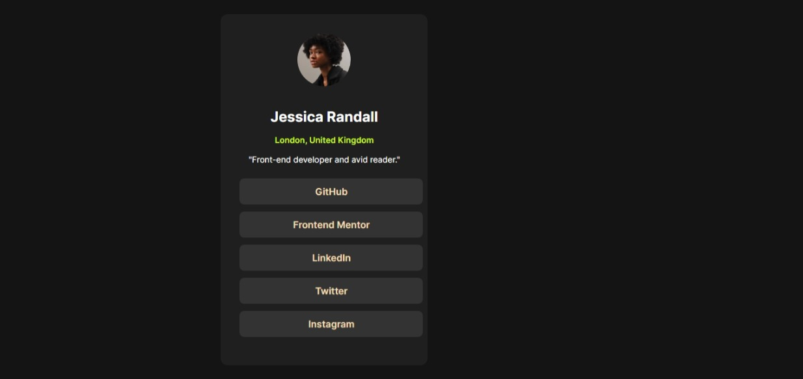

# Frontend Mentor - Social Links Profile Solution

This is my solution to the [Social Links Profile challenge](https://www.frontendmentor.io/challenges/social-links-profile-UG32l9m6dQ) on Frontend Mentor.

## Table of contents

- [Overview](#overview)
  - [The Challenge](#the-challenge)
  - [Screenshot](#screenshot)
  - [Links](#links)
- [My Process](#my-process)
  - [Built With](#built-with)
  - [What I Learned](#what-i-learned)
  - [Continued Development](#continued-development)
- [Author](#author)

---

## Overview

This is a simple, responsive social links profile page built as part of a Frontend Mentor challenge.  
The goal was to recreate the given design as closely as possible using HTML and CSS,  
while ensuring the layout works on both mobile and desktop screens.  

The page includes:
- A profile picture, name, location, and bio.
- A list of social media links with hover and focus states.
- Fully responsive design using a mobile-first approach.
- Custom fonts loaded locally via `@font-face`.

The challenge was a great opportunity to practice semantic HTML, CSS layout techniques, and responsive design principles.

### The Challenge

Users should be able to:
- See hover and focus states for all interactive elements on the page.

### Screenshot



---

### Links

- **Solution URL:** [Frontend Mentor Solution](https://github.com/Ifeoluwayemisi/social-links-profile-main)
- **Live Site URL:** [Live Demo](https://frontendmentortrial.netlify.app/)

---

## My Process
1. **Setup** – Downloaded the challenge starter files from Frontend Mentor and reviewed the style guide (colors, font, spacing).
2. **HTML Structure** – Wrote semantic HTML for the profile card, including headings, paragraphs, and a list of social links.
3. **Styling** – Created `style.css` with:
   - `@font-face` to load the Inter font locally
   - CSS variables for colors
   - Flexbox for centering the card
4. **Responsive Design** – Started with a mobile-first layout (375px) and adjusted styling for larger screens.
5. **Hover States** – Added interactive hover styles for buttons/links to match the challenge requirements.
6. **Final Touches** – Checked alignment, spacing, and cross-browser display before deploying to Netlify.


### Built With

- Semantic HTML5 markup
- CSS custom properties
- Flexbox
- Mobile-first workflow
- `@font-face` for custom fonts

### What I Learned

I learned how to:
- Use `@font-face` to load local fonts
- Center a card both vertically and horizontally using `flexbox`
- Create smooth hover effects with scale animations

**Example CSS snippet:**
```css
ul a:hover {
  background-color: hsl(75, 94%, 57%);
  color: black;
  transform: scale(1.05);
}
```

### Author

- Website – [Racheal’s Portfolio](https://olayoderacheal.netlify.app/)
- Frontend Mentor – [@Ifeoluwayemisi](https://www.frontendmentor.io/profile/Ifeoluwayemisi)
- GitHub – [@Ifeoluwayemisi](https://github.com/Ifeoluwayemisi)
- Twitter – [@YourTwitterHandle](https://twitter.com/destinifeoluwa)
